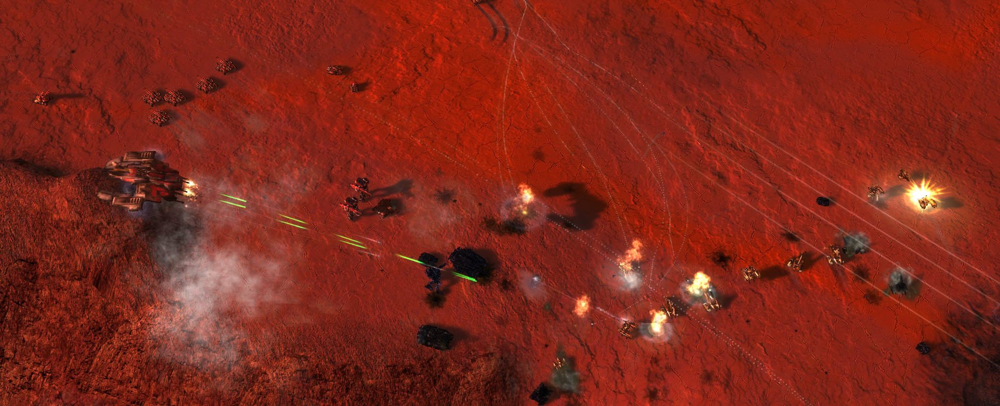

  
### Quick Links
  

  

  
 
  

# Total Mayhem

This repository contains all the assets for the version of [Total Mayhem](https://www.moddb.com/mods/total-mayhem1) that is fully compatible with [FAForever](https://www.faforever.com/). The goal of this repository it to allow the community to maintain the mod. If you found a bug then feel free to [create an issue](). For additional resources and assistance you can visit the Discord server that is linked above. If you'd like to try to fix the mod yourself then do find the the channel called [Modification Resources](https://discord.gg/eQZRwhAP) that lists all the resources you may need on your modding journey!

Promotion material related to the mod:

- [Trailer on Youtube 1](https://www.youtube.com/watch?v=rNLC96tXn_0)
- [Trailer on YouTube 2](https://www.youtube.com/watch?v=VL9jFmC1lmI)
- [Trailer on Youtube 3](https://www.youtube.com/watch?v=W7CyMsra_aM)

## Related repositories

- [FAForever game modes](https://github.com/FAForever/fa)
- [Campaign/co-op featured mod](https://github.com/FAForever/fa-coop)
- [Campaign/co-op maps](https://github.com/FAForever/faf-coop-maps)

### Lua plugin

- [FA Lua intellisense extension](https://github.com/FAForever/fa-lua-vscode-extension)
- [FA Lua intellisense language server](https://github.com/FAForever/fa-lua-language-server)
